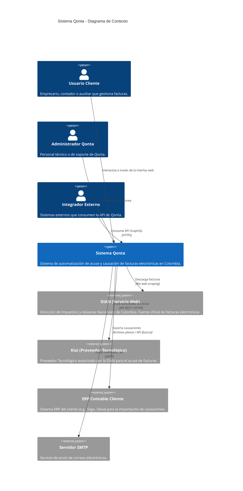
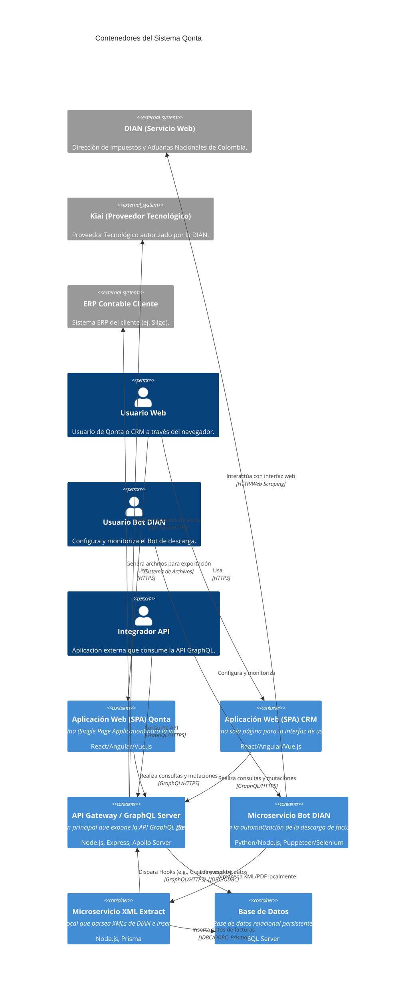

# 3. Arquitectura Técnica de Qonta

Este documento describe la arquitectura técnica del sistema Qonta, incluyendo sus componentes principales, cómo interactúan las diferentes aplicaciones (Qonta Core, CRM, etc.), la estructura de la base de datos y los patrones de integración.

## 3.1 Vista General de la Arquitectura

Qonta se concibe como un ecosistema de microservicios o módulos lógicos interconectados, construidos sobre una base de datos centralizada. La arquitectura está diseñada para ser escalable, extensible y fácil de mantener, permitiendo la adición de nuevas funcionalidades y la integración con sistemas externos.



## 3.2 Aplicaciones y Módulos Principales

El sistema se compone de las siguientes aplicaciones lógicas que comparten la misma base de datos y, en muchos casos, la misma capa de autenticación y autorización.

### 3.2.1 Qonta Core (Módulo Principal)

Es la aplicación central de Qonta, encargada de las funcionalidades principales de facturación electrónica y causación.

  * **Responsabilidades:**
      * Descarga y procesamiento de facturas electrónicas desde la DIAN.
      * Gestión del ciclo de vida de las facturas (recibidas, aprobadas, rechazadas, causadas).
      * Acuse de facturas con el proveedor tecnológico (Kiai).
      * Motor de causación contable basado en reglas de negocio dinámicas (Hooks).
      * Administración de datos maestros (Clientes, Proveedores, Plan de Cuentas, Centros de Costos, Impuestos, etc.).
      * Generación de reportes y exportación de movimientos contables para ERPs.
  * **Tecnologías Clave:** Node.js, Express, Sequelize (ORM), GraphQL, JavaScript (para Hooks), SQL Server (Base de Datos).

### 3.2.2 Módulo CRM (Customer Relationship Management)

Gestiona las relaciones comerciales, oportunidades de venta y seguimiento con prospectos y clientes.

  * **Responsabilidades:**
      * Gestión de contactos y empresas.
      * Seguimiento de oportunidades de negocio.
      * Registro de gestiones y actividades comerciales.
      * Administración de productos y servicios de Qonta.
      * Generación de informes de ventas.
  * **Integración con Qonta Core:** Comparte usuarios y posiblemente información de clientes existentes que se convierten en usuarios de Qonta. Podría haber triggers desde el CRM que inicien procesos en Qonta (ej. un cliente ganado en CRM activa la creación en Qonta).
  * **Tecnologías Clave:** Node.js, Express, Sequelize (ORM), GraphQL, SQL Server.

### 3.2.3 Módulo de Seguridad y Administración (Común)

Aunque no es una "aplicación" separada en el sentido de interfaz de usuario, este módulo representa el conjunto de funcionalidades transversales para la gestión de usuarios, roles, permisos y configuraciones generales del sistema.

  * **Responsabilidades:**
      * Autenticación de usuarios.
      * Autorización basada en roles y permisos.
      * Gestión de módulos y acceso por usuario.
      * Registro de notificaciones.
      * Auditoría de acciones de usuario.
  * **Integración con otros módulos:** Es utilizado por Qonta Core, CRM y cualquier otra aplicación que se añada al ecosistema.
  * **Tecnologías Clave:** Node.js, Express, JWT (JSON Web Tokens), SQL Server.

## 3.3 Base de Datos

El sistema utiliza una base de datos **SQL Server** centralizada.

  * **Diseño:** Modelo Entidad-Relación relacional, normalizado para garantizar la integridad de los datos.
  * **Acceso:** Principalmente a través de Sequelize ORM para la capa de aplicación, aunque también se utilizan consultas SQL directas para optimizaciones o lógica compleja.
  * **Integridad de Datos:** Uso de claves primarias (PK), claves foráneas (FK), índices y restricciones para mantener la consistencia.

## 3.4 Capas de la Aplicación

La arquitectura de cada aplicación sigue un patrón de capas bien definido:

1.  **Capa de Presentación (Frontend):** Interfaces de usuario para Qonta y CRM (probablemente Angular/React/Vue).
2.  **Capa de API (GraphQL):** Expone las funcionalidades del backend a los frontends y a integraciones externas. Utiliza GraphQL para consultas flexibles y eficientes.
3.  **Capa de Lógica de Negocio (Servicios/Controladores):** Contiene la lógica central de cada módulo, coordinando las operaciones, aplicando reglas y gestionando transacciones. Aquí también residen los "Hooks".
4.  **Capa de Acceso a Datos (ORM/Repositorio):** Interactúa directamente con la base de datos (Sequelize ORM), abstrayendo la lógica de persistencia.



## 3.5 Patrones de Integración

### 3.5.1 API GraphQL

  * **Propósito:** Interfaz principal para la comunicación entre el frontend y el backend, y para integraciones de terceros.
  * **Beneficios:** Flexibilidad para los clientes de la API al solicitar solo los datos que necesitan, reduciendo la sobre-obtención y sub-obtención de datos. Documentación auto-generada (Schema).

### 3.5.2 Hooks (Event-Driven)

  * **Propósito:** Permite la extensibilidad del sistema y la adaptación a reglas de negocio específicas de cada cliente sin modificar el código base.
  * **Mecanismo:** Basado en eventos. En puntos específicos del flujo de negocio (ej. `después de guardar factura`, `antes de generar causación`), el sistema invoca código JavaScript personalizado (hooks) que puede leer, modificar o cancelar operaciones. Los hooks se almacenan en la base de datos y se ejecutan en un entorno seguro (sandbox).
  * **Uso:** Ideal para implementar lógica de causación compleja, validaciones específicas, notificaciones personalizadas, etc.

### 3.5.3 Bot de Web Scraping (DIAN)

  * **Propósito:** Automatiza la descarga masiva de facturas electrónicas directamente desde la plataforma de la DIAN.
  * **Mecanismo:** Un microservicio independiente utiliza librerías de automatización de navegador (ej. Puppeteer/Selenium) para simular la interacción humana con el portal de la DIAN, descargar los XML y PDFs de las facturas y luego enviarlos a un sistema de procesamiento para su ingestión.

### 3.5.4 Procesamiento Local de XML (Project Extract XML)

  * **Propósito:** Parsear y estructurar la información de los XML descargados por el Bot DIAN antes de insertarla en la base de datos de Qonta.
  * **Mecanismo:** Un microservicio local basado en Node.js lee los archivos XML, los transforma en JSON y los inserta en las tablas `CufesXML`, `ItemsCufeXML`, `ItemCufeXMLTaxes`, `ItemCufeXMLTaxSubtotals`, `ItemCufeXMLAllowanceCharges` utilizando Prisma. Además, dispara el hook `CrearProveedor` a través de la API de Qonta para gestionar la creación/actualización automática de proveedores.

### 3.5.5 Integración con Proveedor Tecnológico (Kiai)

  * **Propósito:** Cumplir con los requisitos de acuse de la DIAN para facturas electrónicas y eventos Radián.
  * **Mecanismo:** Qonta consume la API REST de Kiai para enviar los eventos de acuse, recibo de mercancías, y aceptación/rechazo de facturas.

### 3.5.6 Exportación a ERPs Contables

  * **Propósito:** Integrar las causaciones generadas en Qonta con los sistemas de contabilidad existentes de los clientes.
  * **Mecanismo:** Actualmente, se realiza principalmente mediante la generación de archivos planos (CSV, TXT) en formatos específicos que los ERPs pueden importar. Se contempla la futura implementación de APIs para una integración más directa.

## 3.6 Despliegue

Los componentes de Qonta (API GraphQL, Microservicio Bot DIAN, Microservicio XML Extract) están diseñados para ser desplegados en entornos contenerizados (Docker) y orquestados (Kubernetes) para asegurar alta disponibilidad y escalabilidad.

## 3.7 Consideraciones de Seguridad

* **Autenticación y Autorización:** Uso de JWT (JSON Web Tokens) para asegurar las APIs. Control de acceso basado en roles y permisos.
* **Protección de Datos:** Cifrado de datos sensibles en la base de datos y en tránsito (HTTPS/TLS).
* **Auditoría:** Registro de eventos clave y cambios en los datos.
* **Seguridad del Bot y XML Extract:** Operación en entornos aislados y con permisos mínimos para minimizar riesgos de acceso no autorizado a credenciales de la DIAN o a la manipulación de datos sensibles.
````http://googleusercontent.com/image_generation_content/6